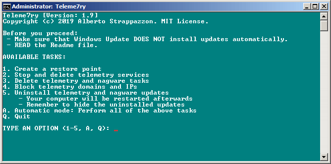
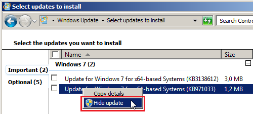

<!-- markdownlint-disable-next-line MD041 -->

  

  <strong>teleme7ry</strong>

  <em>Disable telemetry in Windows 7</em>

> [!IMPORTANT]
> Teleme7ry has reached End of Life on April 26th, 2024. It no longer receives new features, updates, or fixes. However, it is still available for download.
>
> I strongly recommend to upgrade to a [supported Windows version](https://learn.microsoft.com/en-us/windows/release-health/supported-versions-windows-client)
> and use alternative scripts, or switch to a [Linux distribution](https://distrowatch.com/).

## About

This batch script will remove telemetry and nagware-related Tasks, Services and Updates.
It will also block [telemetry domains and IPs](https://github.com/Strappazzon/teleme7ry/blob/-/src/rules.txt).

For more details refer to [the Wiki](https://github.com/Strappazzon/teleme7ry/wiki).

## Getting Started

> [!WARNING]
>
> Before you proceed, please make sure that:
>
> - Windows Update **DOES NOT** install updates automatically.
> - `hosts` file is not write protected. Some antivirus products make it read-only.
> - You have read this README.

- [Download the latest version](https://github.com/Strappazzon/teleme7ry/releases/latest) of Teleme7ry
- Run **teleme7ry.bat** with elevated privileges
  - Teleme7ry will run some checks and if they are successful you will be presented with this display:

### Tasks

- 1\. **Create a restore point**
  - A system restore point with the name "**Teleme7ry vX.Y**" will be created
    - Make sure that System Restore is enabled otherwise the task will fail
- 2\. **Stop and delete telemetry services**
  - Telemetry services will be stopped and deleted
    You can see the full list [here](https://github.com/Strappazzon/teleme7ry/wiki/Telemetry-Services)
- 3\. **Delete telemetry and nagware tasks**
  - Telemetry and nagware tasks will be deleted
    You can see the full list [here](https://github.com/Strappazzon/teleme7ry/wiki/Telemetry-and-nagware-Tasks)
- 4\. **Block telemetry domains and IPs**
  - Teleme7ry rules will be merged with the hosts file
    You can see all the rules [here](https://github.com/Strappazzon/teleme7ry/blob/master/rules.txt)
  - Duplicate lines inside the hosts file, if any, will be removed
    (due to limitations, this includes hosts entries that have nothing to do with telemetry)
- 5\. **Uninstall telemetry and nagware updates**
  - Telemetry and Nagware updates will be uninstalled
    You can see the full list [here](https://github.com/Strappazzon/teleme7ry/wiki/Telemetry-and-Nagware-Updates)
  - Your computer will be restarted aftwerwards
- A *(case insensitive)* **Automatic mode: Perform all of the above tasks**
  - The script will go through every task above, in order
- Q *(case insensitive)* **Quit**
  - The script will quit without making any change to the system

> [!WARNING]
>
> Remember to hide the updates uninstalled by Teleme7ry.
>
> Open the Control Panel and navigate to **System and Security** > **Windows Update** > **Check for Updates** and hide all the
> updates listed [here](https://github.com/Strappazzon/teleme7ry/wiki/Telemetry-and-Nagware-Updates), both under **Important** and **Optional**.
>
> 

## Credits

- [How to stop Microsoft from gathering telemetry data from Windows 7, 8, and 8.1 - Super User](https://superuser.com/a/972506)
- [Blocking Telemetry in Windows 7 and 8.1 - ghacks.net](https://www.ghacks.net/2017/02/11/blocking-telemetry-in-windows-7-and-8-1/)
- [Privacy In Windows 7 - How To Disable Telemetry Data Collection - DeskRoll](https://deskroll.com/blog/article.php?id=Privacy_In_Windows_7_%E2%80%93_How_To_Disable_Telemetry_Data_Collection)
- [dwt_util.py - DisableWinTracking](https://github.com/10se1ucgo/DisableWinTracking/blob/master/dwt_util.py#L138)
- [How to Avoid Windows 7's End-of-Support Nags - How-To Geek](https://www.howtogeek.com/408556/how-to-avoid-windows-7s-end-of-support-nags/)
- [How to disable the "Your Windows 7 PC is out of support" full screen popup - ghacks.net](https://www.ghacks.net/2019/12/12/how-to-disable-the-your-windows-7-pc-is-out-of-support-full-screen-popop/)
- [Updates Blacklist - Blackbird](https://www.getblackbird.net/blacklist/updates/)

<!-- new list -->

- Logo by [Icons8](https://icons8.com/icon/64136/web-shield)
