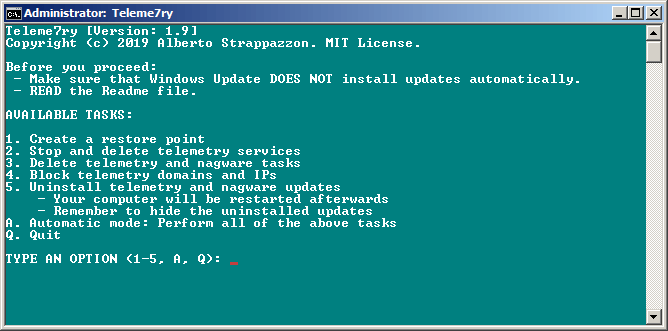
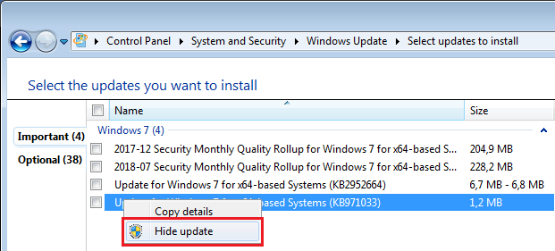

<h1 align="center">
  <br>
  </a>
  <br>
  TELEME7RY
  <br>
</h1>

<h4 align="center">Automated batch script to disable telemetry in Windows 7.</h4>

<p align="center">
  <a href="https://strappazzon.xyz/teleme7ry"></a>
  <a href="https://github.com/Strappazzon/teleme7ry/releases"></a>
  <a href="https://github.com/Strappazzon/teleme7ry/releases/latest"></a>
</p>

<p align="center">
  <a href="#about">About</a> •
  <a href="#getting-started">Getting Started</a> •
  <a href="#download">Download</a> •
  <a href="#bugs-issues">Issues</a> •
  <a href="#credits">Credits</a> •
  <a href="#license">License</a>
</p>

## About

This batch script will remove telemetry and nagware-related Tasks, Services and Updates.

It will also block [telemetry domains and IPs](https://github.com/Strappazzon/teleme7ry/blob/master/rules.txt).

For more details refer to [the Wiki](https://github.com/Strappazzon/teleme7ry/wiki).

## Getting Started

> ###  **WARNING**
>
> Before you proceed, please make sure that:
>
> - Windows Update DOES NOT install updates automatically.
> - hosts is not write protected. Some antivirus products make it read-only.
> - You have read this README.

Run **teleme7ry.bat** with elevated privileges.

Teleme7ry will run some checks and if they are successful you will be presented with this display:



Here's a description of each task:

- 1\. **Create a restore point**
  - A system restore point with the name "**Teleme7ry vX.Y**" will be created.
    - Make sure that System Restore is On otherwise the task will fail.
- 2\. **Stop and delete telemetry services**
  - Telemetry services will be stopped and deleted. You can see the full list [here](https://github.com/Strappazzon/teleme7ry/wiki/Telemetry-Services).
- 3\. **Delete telemetry and nagware tasks**
  - Telemetry and nagware tasks will be deleted. You can see the full list [here](https://github.com/Strappazzon/teleme7ry/wiki/Telemetry-and-nagware-Tasks).
- 4\. **Block telemetry domains and IPs**
  - Teleme7ry rules will be merged with the hosts file. You can see all the rules [here](https://github.com/Strappazzon/teleme7ry/blob/master/rules.txt).
  - Duplicate lines inside the hosts file, if any, will be removed (due to limitations, this includes hosts entries that have nothing to do with telemetry).
- 5\. **Uninstall telemetry and nagware updates**
  - Telemetry and Nagware updates will be uninstalled. You can see the full list [here](https://github.com/Strappazzon/teleme7ry/wiki/Telemetry-and-Nagware-Updates).
  - Your computer will be restarted aftwerwards.
- A *(case insensitive)*. **Automatic mode: Perform all of the above tasks**
  - The script will go through every task above, in order.
- Q *(case insensitive)*. **Quit**
  - The script will quit without making changes to the system.

> ###  **ATTENTION**
>
> Remember to hide the updates uninstalled by Teleme7ry.
>
> Press **Win + R**, type **control** and hit enter. The Control Panel will show up.
>
> Navigate to **System and Security** > **Windows Update** > **Check for Updates** and hide all the updates listed [here](https://github.com/Strappazzon/teleme7ry/wiki/Telemetry-and-Nagware-Updates), under **Important** and **Optional**.



## Download

You can [download](https://github.com/Strappazzon/teleme7ry/releases/latest) the latest version of Teleme7ry from the Releases page.

## Bugs? Issues?

But also suggestions? New ideas?

Please create an [issue on GitHub](https://github.com/Strappazzon/teleme7ry/issues/new/choose).

## Credits

### Updates, Hosts, Services and Tasks

- [How to stop Microsoft from gathering telemetry data from Windows 7, 8, and 8.1 - Super User](https://superuser.com/a/972506)
- [Blocking Telemetry in Windows 7 and 8.1 - ghacks.net](https://www.ghacks.net/2017/02/11/blocking-telemetry-in-windows-7-and-8-1/)
- [Privacy In Windows 7 – How To Disable Telemetry Data Collection - DeskRoll](https://deskroll.com/blog/article.php?id=Privacy_In_Windows_7_%E2%80%93_How_To_Disable_Telemetry_Data_Collection)
- [dwt_util.py - DisableWinTracking](https://github.com/10se1ucgo/DisableWinTracking/blob/master/dwt_util.py#L138)
- [How to Avoid Windows 7’s End-of-Support Nags - How-To Geek](https://www.howtogeek.com/408556/how-to-avoid-windows-7s-end-of-support-nags/)
- [How to disable the "Your Windows 7 PC is out of support" full screen popup - ghacks.net](https://www.ghacks.net/2019/12/12/how-to-disable-the-your-windows-7-pc-is-out-of-support-full-screen-popop/)
- [Updates Blacklist - Blackbird](https://www.getblackbird.net/blacklist/updates/)

### Logo

- [Icons8](https://icons8.com/icons/set/filter)

## License

```
MIT License

Copyright (c) 2018 - 2020 Alberto Strappazzon

Permission is hereby granted, free of charge, to any person obtaining a copy
of this software and associated documentation files (the "Software"), to deal
in the Software without restriction, including without limitation the rights
to use, copy, modify, merge, publish, distribute, sublicense, and/or sell
copies of the Software, and to permit persons to whom the Software is
furnished to do so, subject to the following conditions:

The above copyright notice and this permission notice shall be included in all
copies or substantial portions of the Software.

THE SOFTWARE IS PROVIDED "AS IS", WITHOUT WARRANTY OF ANY KIND, EXPRESS OR
IMPLIED, INCLUDING BUT NOT LIMITED TO THE WARRANTIES OF MERCHANTABILITY,
FITNESS FOR A PARTICULAR PURPOSE AND NONINFRINGEMENT. IN NO EVENT SHALL THE
AUTHORS OR COPYRIGHT HOLDERS BE LIABLE FOR ANY CLAIM, DAMAGES OR OTHER
LIABILITY, WHETHER IN AN ACTION OF CONTRACT, TORT OR OTHERWISE, ARISING FROM,
OUT OF OR IN CONNECTION WITH THE SOFTWARE OR THE USE OR OTHER DEALINGS IN THE
SOFTWARE.
```
